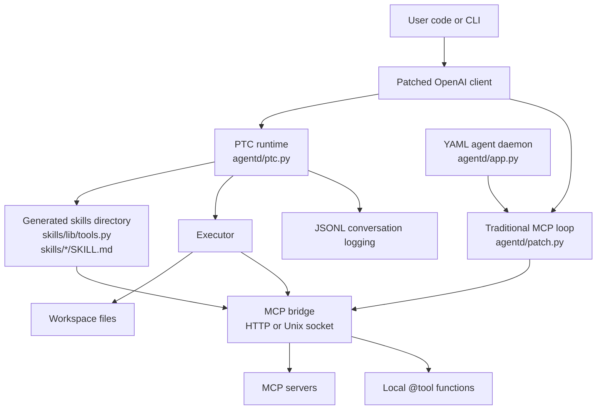
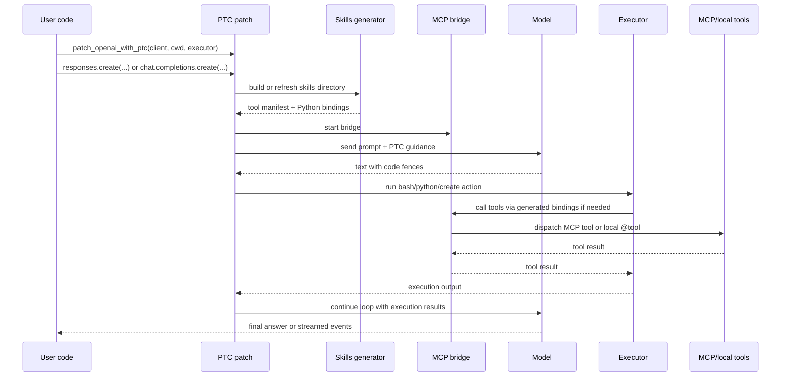
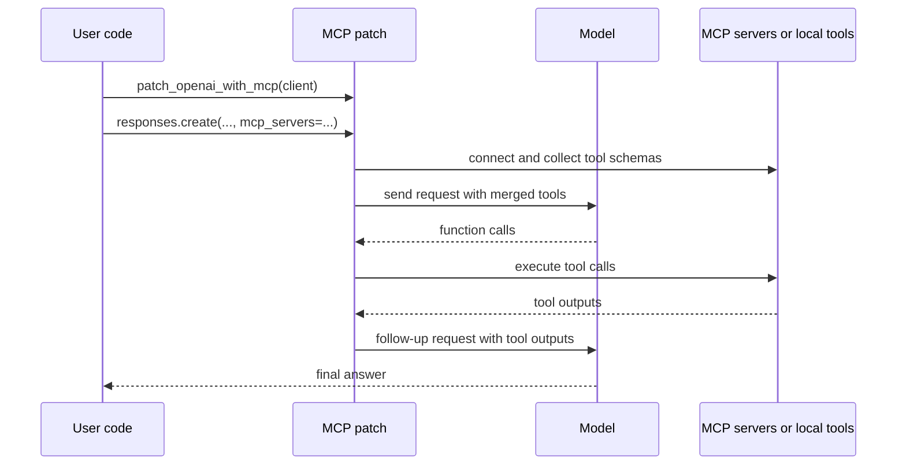
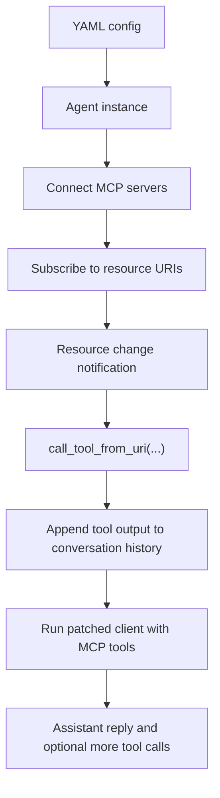
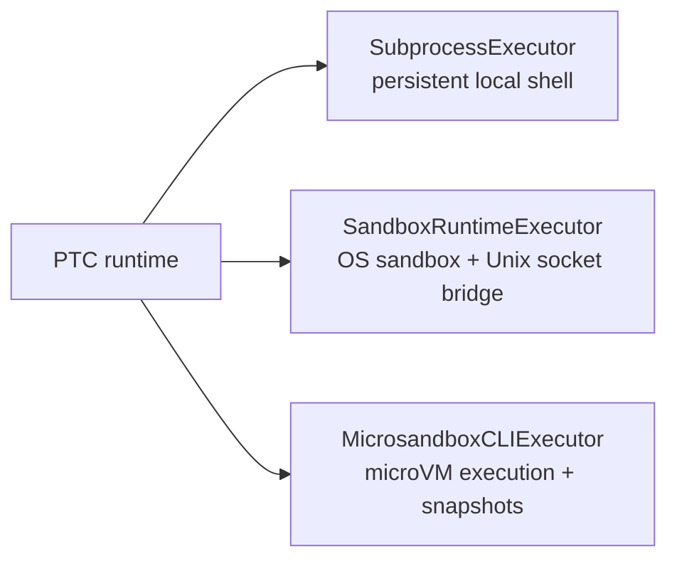

# Understanding `agentd`

`agentd` is an LLM agent toolkit centered on two related ideas:

1. Programmatic Tool Calling (PTC): let the model write executable code fences instead of emitting JSON tool calls.
2. MCP-native agent loops: connect models to MCP servers, local Python tools, and reactive subscriptions with minimal glue.

At a high level, this repo is not a single app. It is a Python package, a patched client runtime, a small CLI daemon, a set of executors, and a collection of examples/tests showing how those pieces fit together.

## One-Screen Summary

If you only want the short version:

- `agentd/ptc.py` is the core differentiator. It patches the OpenAI client so the model can act through fenced `bash`, `python`, and `file:create` blocks.
- `agentd/patch.py` is the more conventional path. It patches the client to run standard MCP and local function tools in a normal tool-calling loop.
- `agentd/mcp_bridge.py` is the glue that makes generated Python bindings and sandboxed execution work with MCP servers.
- `agentd/app.py` is a YAML-driven agent daemon that subscribes to MCP resources and reacts to change notifications.
- The executor modules provide three execution modes: plain subprocess, OS-level sandboxing, and microVM isolation.

## What Problem This Repo Solves

Most agent stacks expose tools as JSON schemas and expect the model to produce structured tool calls. `agentd` supports that model, but it also pushes a different workflow:

- Give the model a working directory.
- Generate a discoverable `skills/` tree.
- Let the model inspect that tree like an engineer would.
- Let it execute shell and Python directly.
- Use a local bridge so those scripts can still call MCP tools or local Python tools.

That shifts the mental model from "the model chooses from hidden tools" to "the model explores an environment and writes code against it."

## Architecture Overview



## The Repo Has Two Main Personalities

### 1. Programmatic Tool Calling

This is the most opinionated part of the repo.

Instead of giving the model tool schemas and waiting for JSON tool calls, `patch_openai_with_ptc(...)`:

- injects guidance telling the model how to write executable fences
- prepares a `skills/` directory that looks like an AgentSkills-style tool library
- exposes MCP tools and `@tool` functions as importable Python bindings in `skills/lib/tools.py`
- parses model output for executable fences
- runs those fences with a pluggable executor
- feeds command output back into the conversation until the model reaches a final answer

Supported fence styles include:

- ```` ```bash:execute ````
- ```` ```python:execute ````
- ```` ```filename.ext:create ````
- Claude-style XML `<invoke>` function-call blocks

### 2. Traditional MCP + Tool Calling

This path is closer to a standard tool-enabled LLM loop.

`patch_openai_with_mcp(...)`:

- gathers schemas from MCP servers
- merges them with locally registered `@tool` functions and any explicit tool schemas
- patches `chat.completions.create`, `responses.create`, and `embeddings.create`
- executes tool calls automatically
- re-injects tool results until the model stops calling tools

This path is simpler when you want normal tool calling semantics and do not need the code-fence execution model.

## PTC Request Flow



### Why the `skills/` directory matters

The generated `skills/` tree is how PTC turns opaque tools into something the model can inspect:

```text
skills/
  lib/
    __init__.py
    tools.py
  <mcp-skill>/
    SKILL.md
    scripts/
  local/
    SKILL.md
    scripts/
```

That structure gives the model:

- shared Python imports for every tool
- per-skill documentation in `SKILL.md`
- example scripts under `scripts/`
- a small CLI (`skills list`, `skills read`, `skills run`) for discovery inside bash execution

This is the core "developer environment for the model" idea in the repo.

## Traditional MCP Flow



This path is useful when:

- you want standard tool-calling behavior
- you do not need a shell-oriented agent
- you want MCP tools, local decorators, and explicit schemas merged in one place

## Agent Daemon Flow

`agentd/app.py` is a separate operating mode from the library-style patches. It reads YAML config, launches agents, connects to MCP servers, subscribes to resource URIs, and reacts when those resources change.



This is the automation/reactive side of the repo. The examples in `config/` show patterns like:

- monitor a URL for facts or news
- monitor a filesystem location
- react to updates using MCP tools such as fetch or filesystem operations

## Execution and Isolation Options

PTC uses an executor abstraction so the same agent behavior can run in different environments.



### Executor choices

| Executor | File | What it gives you | Best fit |
| --- | --- | --- | --- |
| `SubprocessExecutor` | `agentd/ptc.py` | Fast local execution with a persistent shell session | Local development and trusted code |
| `SandboxRuntimeExecutor` | `agentd/sandbox_runtime_executor.py` | OS-level filesystem/network restrictions via `srt` | Lightweight isolation |
| `MicrosandboxCLIExecutor` | `agentd/microsandbox_cli_executor.py` | MicroVM-based isolation via `msb exe` | Strongest isolation |

Both sandboxed executors support snapshots, which means the workspace can be saved and restored across turns.

## Important Supporting Modules

| Path | Role |
| --- | --- |
| `agentd/ptc.py` | Main PTC implementation: prompt injection, fence parsing, streaming helpers, skills generation, executor protocol, client patching |
| `agentd/patch.py` | Traditional MCP/tool-calling patching logic for completions, responses, and embeddings |
| `agentd/mcp_bridge.py` | Local bridge that routes generated tool bindings to MCP servers or local Python functions |
| `agentd/tool_decorator.py` | `@tool` decorator that registers a function and generates a JSON schema from signature/docstring |
| `agentd/conversation_logger.py` | JSONL logging for messages, tool calls, and tool results |
| `agentd/app.py` | CLI daemon for YAML-configured agents with subscriptions and interactive input |
| `agentd/model/config.py` | Small dataclass layer for daemon configuration |
| `agentd/__init__.py` | Public package surface exported to users |

## Public API Surface

The exports in `agentd/__init__.py` make the intended public entry points clear:

- `patch_openai_with_ptc`
- `patch_openai_with_mcp`
- `display_events`
- `tool`
- `create_sandbox_runtime_executor`
- `create_microsandbox_cli_executor`

This tells you the package is designed to be embedded from application code, not only run as a CLI.

## Design Choices That Define the Repo

### 1. Monkey-patching the client is the primary integration strategy

Both main runtimes work by patching the OpenAI client methods rather than building a separate orchestration framework.

That makes the package easy to drop into existing code, but it also means the interesting behavior is concentrated in the patched wrappers.

### 2. LiteLLM broadens model support

The project uses LiteLLM so the same patched API shape can work with OpenAI and non-OpenAI model identifiers. The README examples use OpenAI, Anthropic, and Gemini-style model names.

### 3. MCP is the common tool substrate

Whether you use normal tool calling or PTC, MCP is the external tool protocol around which the repo is built.

### 4. PTC treats the model more like a coding agent than a function caller

The model is expected to:

- inspect files
- read skill docs
- write scripts
- execute shell/Python
- reason incrementally from real command output

That is a different interaction model from one-shot tool selection.

### 5. Sandboxed execution is a first-class concern

The bridge supports Unix sockets specifically so MCP tools still work when network namespaces are isolated. That detail is a strong signal that secure execution was designed into the architecture, not added later as an afterthought.

## Examples and What They Demonstrate

| Example | What it shows |
| --- | --- |
| `examples/ptc_streaming.py` | Basic PTC loop with streaming display events |
| `examples/ptc_with_tools.py` | Local Python functions registered with `@tool` |
| `examples/ptc_with_mcp.py` | PTC using MCP servers exposed through generated bindings |
| `examples/ptc_sandbox_runtime.py` | PTC with OS-level sandboxing |
| `examples/ptc_microsandbox.py` | PTC with microVM execution |
| `examples/file_retrieval_complete.py` | Additional end-to-end library usage example |
| `examples/code_interpreter.py` | Code-execution-oriented usage pattern |

If you are trying to understand intended usage quickly, the examples are the fastest path after reading this document.

## Tests and What They Cover

The tests are useful because they reveal expected behavior more directly than prose:

| Test file | What to look for |
| --- | --- |
| `test/test_ptc.py` | Fence parsing, hallucination stripping, XML invoke support |
| `test/test_mcp_bridge.py` | Bridge lifecycle, tool listing, local tool dispatch, error handling |
| `test/test_responses.py` | Patched Responses API behavior |
| `test/test_responses_stream.py` | Streaming behavior for patched responses |
| `test/test_compare_streaming_events.py` | Event-shape expectations across streaming paths |
| `test/test_mixed_tools.py` | Mixing explicit schemas, local decorators, and MCP servers |
| `test/test_patch.py` | Traditional patch behavior |

Two especially important behavioral themes show up in tests:

- PTC strips text after executable fences to avoid trusting hallucinated output.
- The bridge and patch layers are expected to hide most of the MCP wiring from the caller.

## Config Files

The `config/` directory contains daemon-oriented examples:

- `config/facts.yaml`
- `config/filesystem.yaml`
- `config/ycombinator-config.yaml`

These show the shape of an `agentd` daemon config:

- agent name
- model
- system prompt
- MCP servers to launch
- subscriptions to monitor

## A Good Reading Order

If you want to build a mental model of the repo with minimal thrash, read it in this order:

1. `README.md`
2. `agentd/__init__.py`
3. `agentd/ptc.py`
4. `agentd/mcp_bridge.py`
5. `agentd/patch.py`
6. `agentd/tool_decorator.py`
7. One sandbox executor: `agentd/sandbox_runtime_executor.py` or `agentd/microsandbox_cli_executor.py`
8. `agentd/app.py`
9. `examples/`
10. `test/test_ptc.py` and `test/test_mcp_bridge.py`

## If You Need a Crisp Mental Model

You can think of the repo like this:

- `patch.py` says: "Make normal tool calling with MCP feel automatic."
- `ptc.py` says: "Give the model a tool-aware coding workspace and let it operate like an engineer."
- `mcp_bridge.py` says: "Make those tools reachable no matter where the code is running."
- the executor modules say: "Choose how safe or isolated execution should be."
- `app.py` says: "Now turn that into long-running agents that react to subscriptions."

That combination is what this repo is really about.
