# agentd - Architecture & Design Guide

A comprehensive guide to understanding the **agentd** framework — an LLM agent utilities library that gives any OpenAI-compatible client transparent access to MCP tools, bash execution, and sandboxed code running.

---

## What is agentd?

agentd solves a fundamental problem: **how do you give an LLM safe, discoverable access to external tools?**

It provides two distinct paradigms, both implemented as monkey-patches on the standard OpenAI Python SDK:

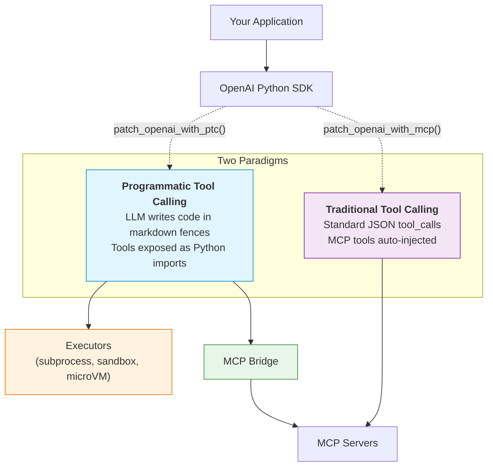

---

## High-Level Architecture

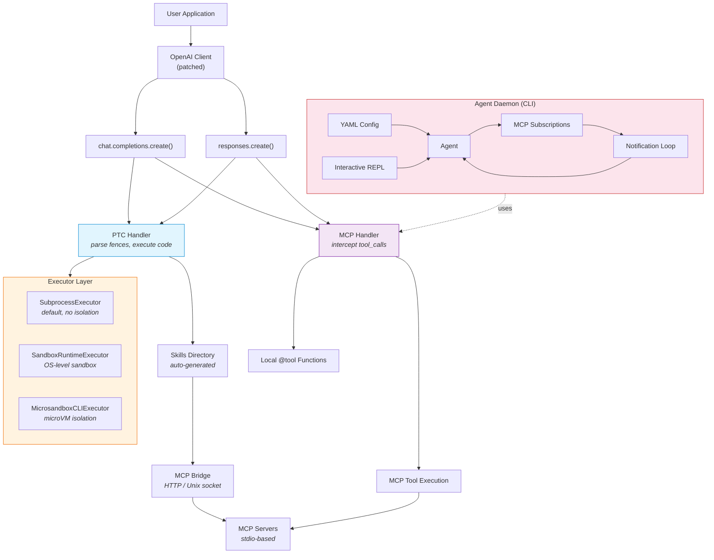

---

## Paradigm 1: Programmatic Tool Calling (PTC)

PTC replaces JSON `tool_calls` with **code fences** in the LLM's response. The LLM writes bash or Python directly, and agentd intercepts the stream, executes the code, and feeds results back.

### How PTC Works

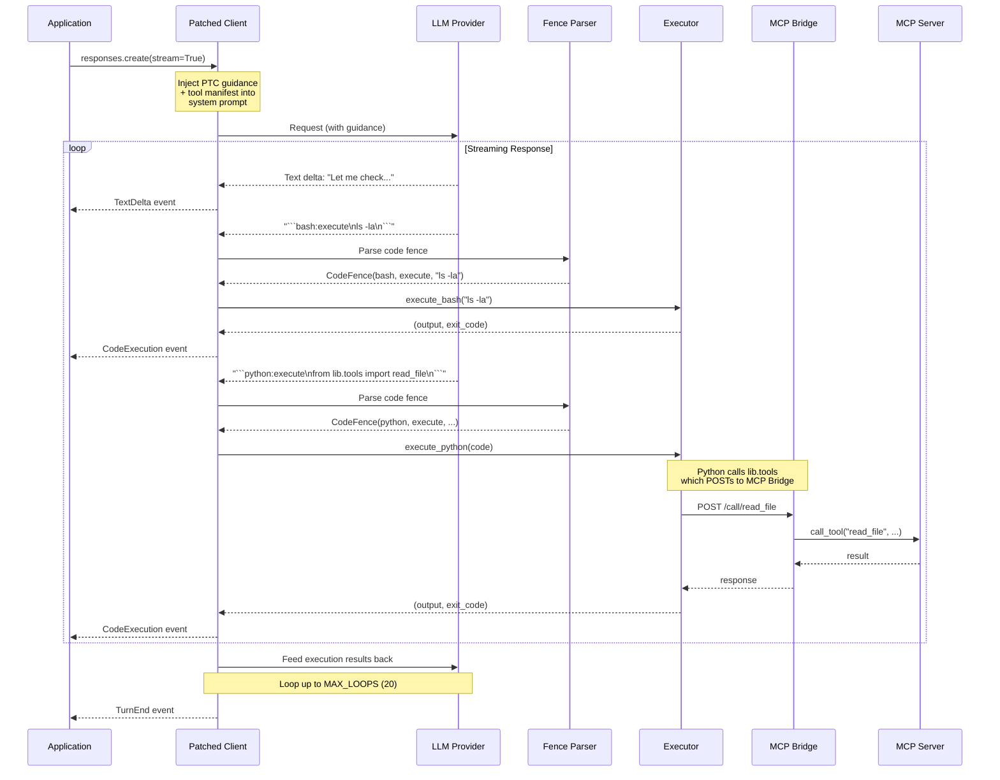

### Code Fence Format

The LLM produces fenced code blocks with a `type:action` header:

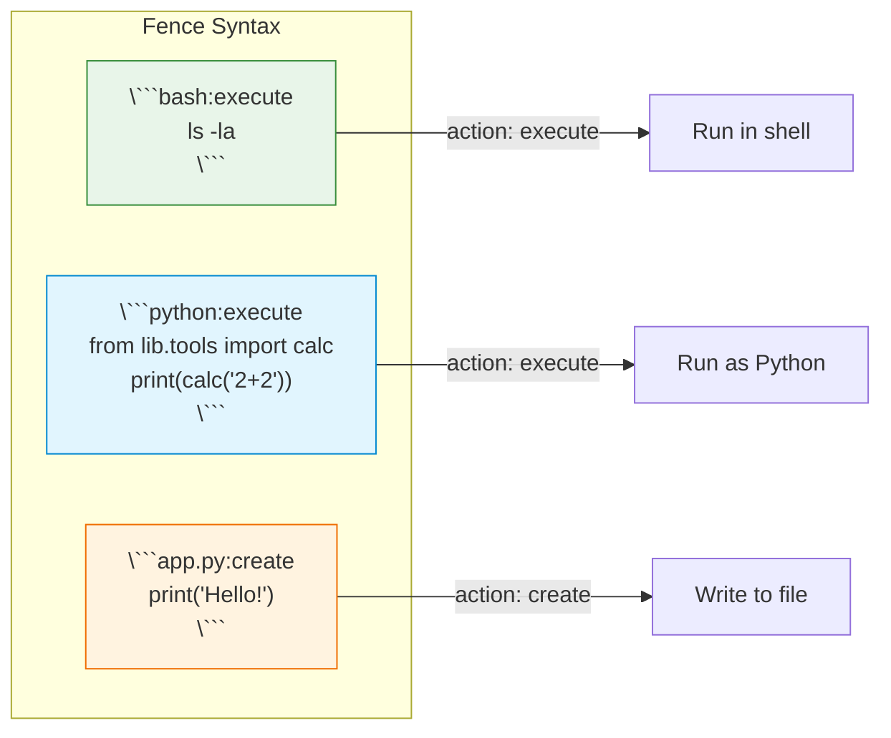

**Execution rules:**

- Back-to-back fences (no text between) run **in parallel**
- Text between fences forces **sequential** execution
- Also supports Claude's XML `<invoke>` format

### Skills Directory (Auto-Generated)

When MCP servers or `@tool` functions are provided, PTC generates a skills directory that the LLM can explore:

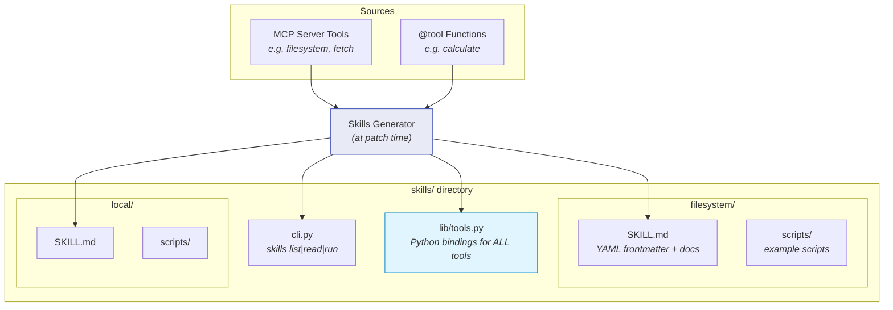

The LLM discovers tools naturally:

```
skills list → filesystem, local
skills read filesystem → SKILL.md with tool docs
python -c "from lib.tools import read_file; print(read_file(path='/tmp/x'))"
```

`lib/tools.py` contains generated Python functions that POST to the MCP Bridge:

```python
def read_file(path: str) -> dict:
    return _call("read_file", path=path)  # → POST http://bridge/call/read_file
```

---

## Paradigm 2: Traditional Tool Calling (MCP Patch)

For standard JSON `tool_calls` — the patched client transparently handles MCP tool discovery, execution, and result feeding.

### How MCP Patching Works

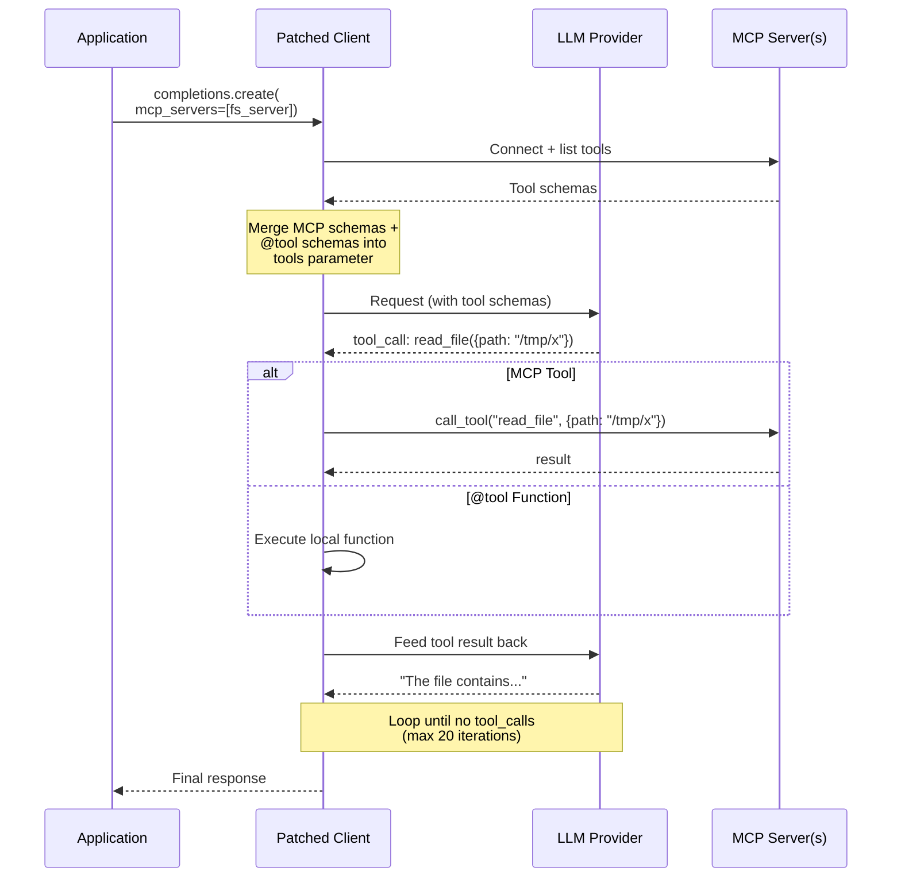

### Multi-Provider Support via LiteLLM

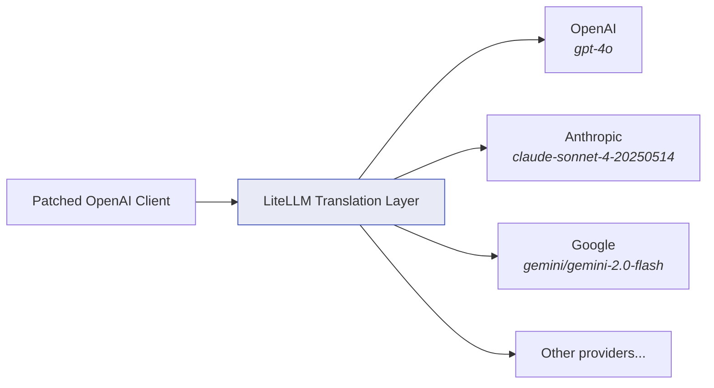

The patching is transparent — you use the standard OpenAI SDK interface regardless of the underlying provider.

---

## Executor Layer

The Executor protocol defines how code is actually run. All executors implement the same interface:

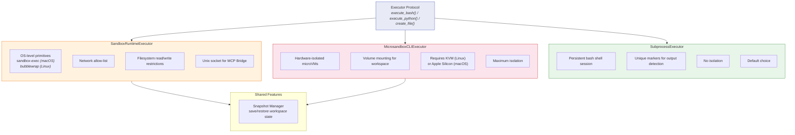

### Isolation Comparison

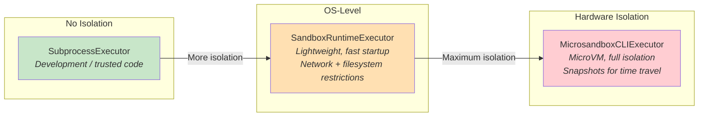

---

## MCP Bridge

The MCP Bridge is an HTTP/Unix socket server that sits between sandboxed code and MCP servers on the host. It's essential for PTC because the LLM's generated Python code runs in a subprocess (possibly sandboxed) and needs a way to call MCP tools.

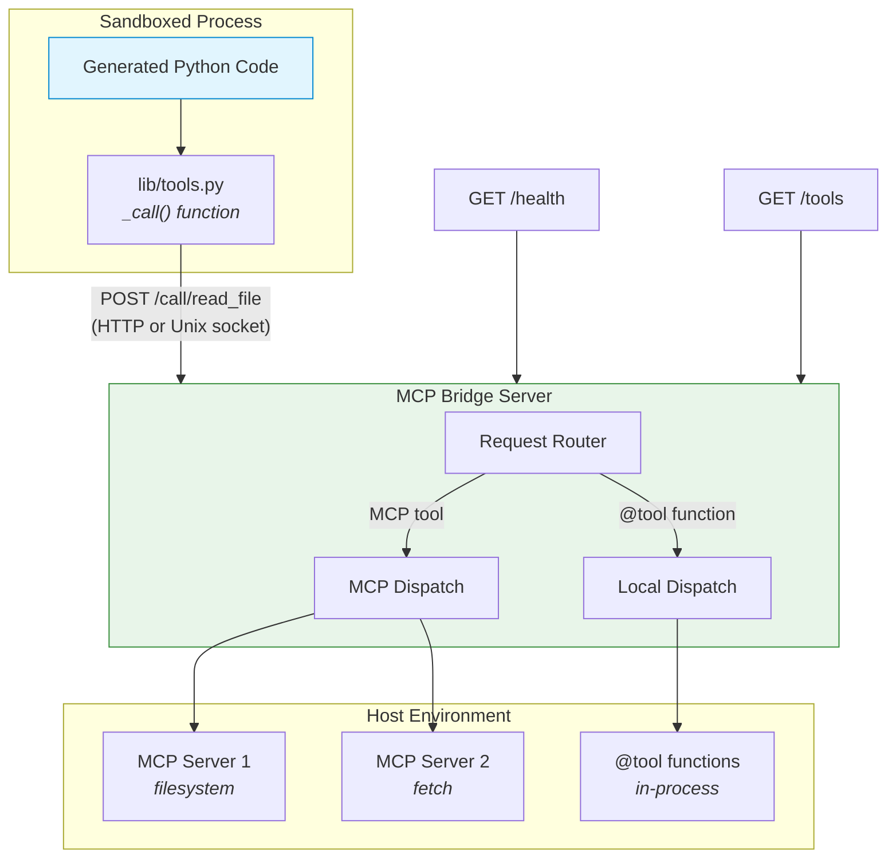

**Endpoints:**

- `POST /call/{tool_name}` — Execute a tool by name
- `GET /tools` — List available tools and schemas
- `GET /health` — Health check

**Transport modes:**

- **TCP** (port-based) — For unsandboxed or network-accessible environments
- **Unix socket** — For sandboxed execution where network is isolated but filesystem is shared

---

## Agent Daemon

The Agent Daemon (`agentd` CLI) runs YAML-configured agents that **react to MCP resource changes** using the subscription pattern.

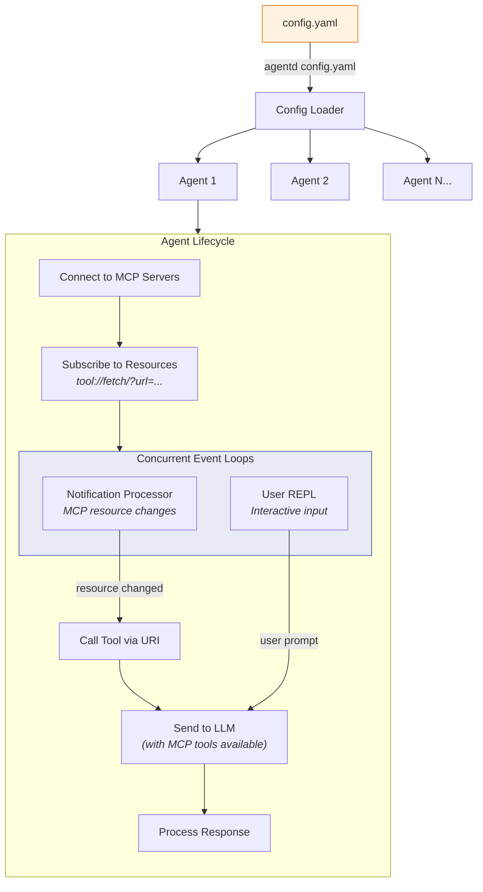

### Subscription Flow

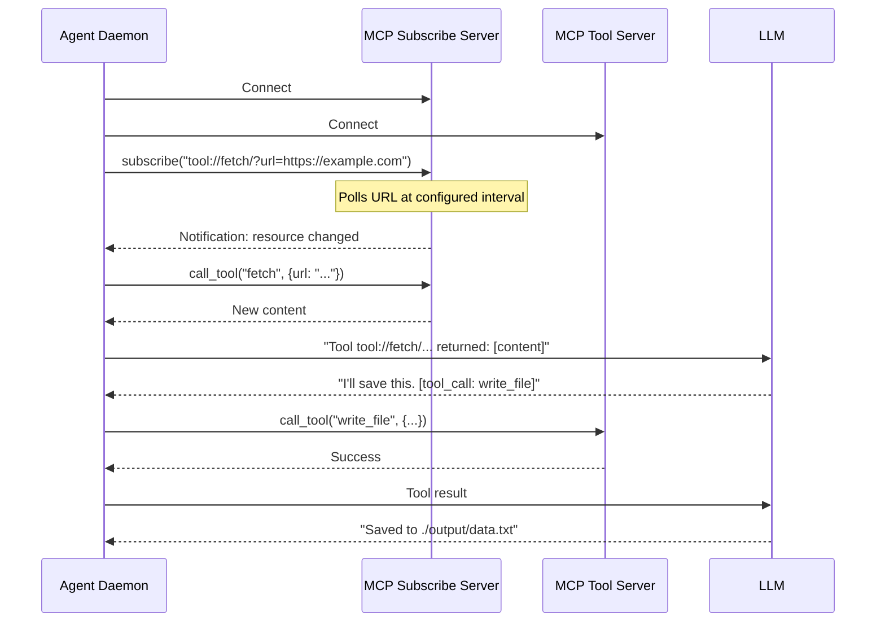

---

## Conversation Logging

All interactions are logged as JSONL files for debugging and analysis:

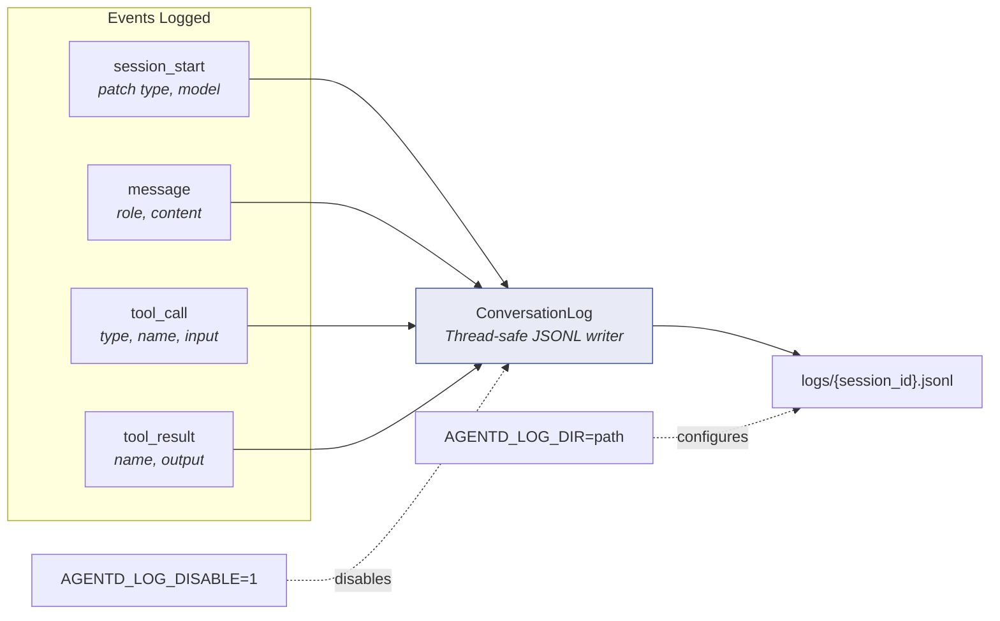

---

## @tool Decorator

Register Python functions as tools with auto-generated JSON schema:

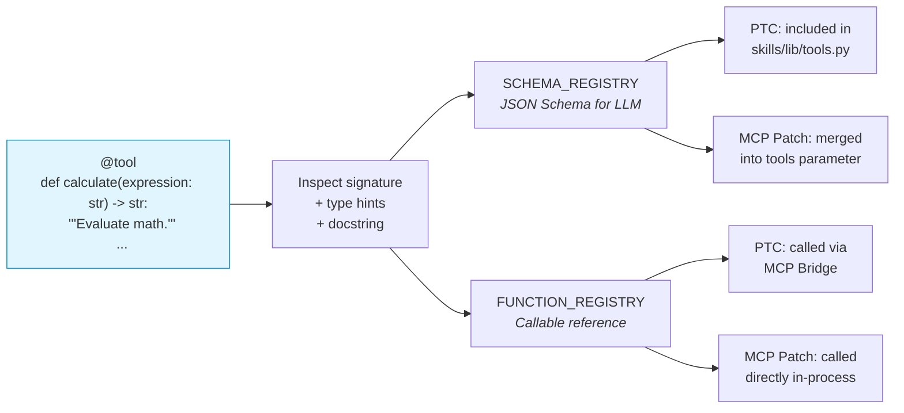

---

## Data Flow Summary

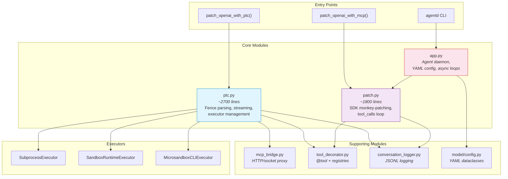

---

## Key Design Decisions

| Decision                            | Rationale                                                               |
|-------------------------------------|-------------------------------------------------------------------------|
| **Monkey-patching OpenAI SDK**      | Zero API changes — existing code works with one line added              |
| **Code fences over tool_calls**     | More natural for bash/Python; LLM can chain logic in a single block     |
| **Auto-generated skills directory** | LLM discovers tools via filesystem exploration, not system prompt bloat |
| **Pluggable executors**             | Same interface from dev (subprocess) through production (microVM)       |
| **MCP Bridge as HTTP server**       | Sandboxed processes can't access host MCP connections directly          |
| **Unix socket transport**           | Works inside network-isolated sandboxes where TCP is blocked            |
| **LiteLLM for multi-provider**      | One patched client works with OpenAI, Anthropic, Google, etc.           |
| **MAX_LOOPS = 20**                  | Prevents runaway tool-calling loops                                     |
| **Output truncation at 20k chars**  | Prevents token waste on huge command outputs                            |

---

## Quick Reference

### Installation

```bash
pip install agentd
```

### PTC (code fences)

```python
from agentd import patch_openai_with_ptc, display_events
client = patch_openai_with_ptc(OpenAI(), cwd="./workspace")
stream = client.responses.create(model="...", input="...", stream=True)
for event in display_events(stream):
    ...
```

### MCP Patch (tool_calls)

```python
from agentd import patch_openai_with_mcp
client = patch_openai_with_mcp(OpenAI())
response = client.chat.completions.create(model="...", messages=[...], mcp_servers=[...])
```

### Agent Daemon

```bash
agentd config.yaml
```

### Sandboxed Execution

```python
from agentd import create_sandbox_runtime_executor, create_microsandbox_cli_executor

# OS-level (lightweight)
executor = create_sandbox_runtime_executor(conversation_id="s1", allowed_domains=["github.com"])

# MicroVM (maximum isolation)
executor = create_microsandbox_cli_executor(conversation_id="s1", image="python")

client = patch_openai_with_ptc(OpenAI(), executor=executor)
```
